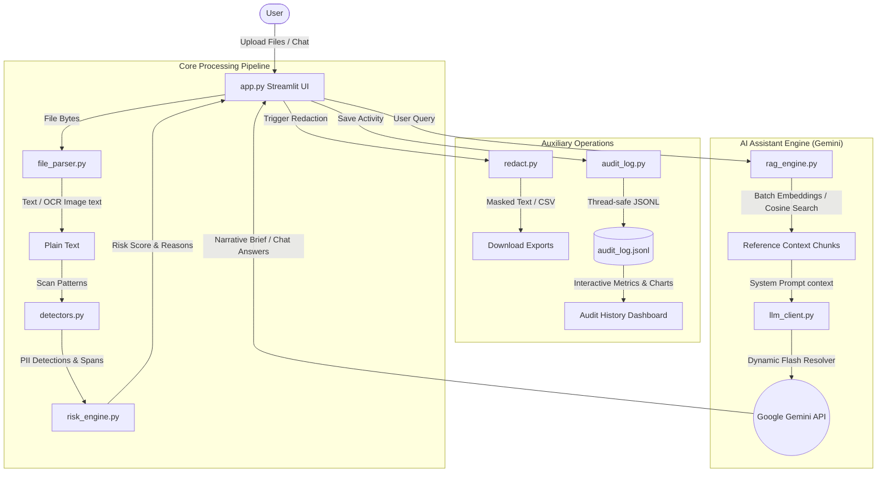

# 🔒 Sensitive Data Detection & Compliance Assistant

An AI-powered application that scans uploaded documents (PDF, TXT, CSV, PNG, JPG) for sensitive and confidential information, classifies the document's risk level, generates a compliance/security summary, and answers free-form questions about the document — all in a single, modern Streamlit interface.

---

## 🚀 1. Setup Instructions

### Prerequisites
- Python 3.10+
- A **Google Gemini API Key** for generative summaries, embedding-based RAG, and Q&A. The app runs fully **without** a key too, using deterministic fallbacks.
- (Optional) Tesseract OCR binary installed on your system PATH for scanning image-based files.

### Install & Run Locally

1. Clone the repository and navigate to the directory:
   ```bash
   git clone <this-repo-url>
   cd sensitive-data-compliance-assistant
   ```

2. Set up and activate a Python virtual environment:
   ```bash
   python -m venv venv
   # On Windows:
   venv\Scripts\activate
   # On macOS/Linux:
   source venv/bin/activate
   ```

3. Install requirements:
   ```bash
   pip install -r requirements.txt
   ```

4. Configure your environment:
   Copy the example environment file and insert your Gemini API Key:
   ```bash
   cp .env.example .env
   # Edit .env and set:
   # GEMINI_API_KEY=your_gemini_api_key
   ```

5. Launch the Streamlit application:
   ```bash
   streamlit run app.py
   ```
   The application will open in your browser at `http://localhost:8501`.

### Run with Docker

```bash
docker build -t sensitive-data-assistant .
docker run -p 8501:8501 -e GEMINI_API_KEY=your_key_here sensitive-data-assistant
```

### Run Tests

Run the test suite to verify patterns, Verhoeff checksums, and RAG chunking logic:
```bash
venv/Scripts/python -m pytest test_detectors.py test_rag.py -v
```

### Test Datasets
Try scanning the pre-configured mock data located in the `sample_data/` folder:
- `sample_data/sample_document.txt`
- `sample_data/sample_customers.csv`

---

## 🏗️ 2. Architecture Diagram



### Module Breakdown

| Module | Responsibility |
| :--- | :--- |
| **`app.py`** | Streamlit UI. Manages navigation, upload registries, side-by-side charts, chatbot speech-bubble formatting, and history views. |
| **`file_parser.py`** | Extracts text from PDF (`pypdf`), CSV (`pandas`), TXT, and images (OCR via optional `pytesseract`). |
| **`detectors.py`** | Matches sensitive identifiers (PAN, credit card, bank account, emails, credentials, employee IDs) using regex and Verhoeff/Luhn checksum algorithms. |
| **`risk_engine.py`** | Explains risk levels (High, Medium, Low) and reasons based on the severity of the flagged PII. |
| **`redact.py`** | Masks PII identifiers in plain text or CSV cells (preserving structural formats and formatting card/account suffixes). |
| **`rag_engine.py`** | Splits text into overlapping chunks, builds local TF-IDF matrices, and queries Gemini embeddings for document-level RAG. |
| **`llm_client.py`** | Resolves active Gemini models dynamically at runtime (`gemini-3.5-flash`, `gemini-2.5-flash`, etc.) to execute summary and Q&A prompts. |
| **`audit_log.py`** | Manages thread-safe writing and reading of historic JSONL logging entries. |
| **`test_detectors.py`** | Asserts pattern matches, Verhoeff Aadhaar validations, and secret formats. |
| **`test_rag.py`** | Verifies TF-IDF cosine indexing and RAG overlapping chunk boundaries. |

---

## 💡 3. AI/ML & Engineering Approach

This project balances deterministic scanning with semantic generative modeling to keep compliance checks secure, explainable, and cost-controlled:

1. **Aadhaar Checksum Validation**:
   Instead of naively flagging any 12-digit number, Aadhaar scanning validates the **Verhoeff checksum algorithm** in Python. This eliminates false positive number configurations.
2. **Luhn Algorithm Card Validation**:
   All candidate 13-19 digit credit card numbers are verified against the **Luhn checksum algorithm**, ensuring only valid card structures are flagged.
3. **Contextual Account Classification**:
   Matches 9-18 digit runs near terms like "Account," "A/C," or "IBAN" as bank accounts to avoid overlap with generic numbers.
4. **Dynamic model resolution**:
   Rather than hardcoding deprecated endpoints, `llm_client.py` queries the active Gemini models list at runtime, selecting the highest-priority supported model name (e.g. `gemini-3.5-flash`, `gemini-2.5-flash`).
5. **Hybrid RAG Engine**:
   RAG indexing automatically generates vector embeddings online via Gemini. If no API key is present or queries fail, it falls back to a custom, zero-dependency offline **TF-IDF sparse vectorizer** using Cosine Similarity scores.
6. **Thread-Safe Audit Ledger**:
   Stores audit histories inside a JSONL file utilizing thread locking (`threading.Lock()`), making logs safe against concurrent uploads or asynchronous calls.

---

## 📈 4. Core Features

- **Side-by-Side Analysis**: Findings are visually broken down via a tabular detailed match view next to an Altair horizontal bar chart of occurrences.
- **Top Actions Row**: Merges risk classification cards and secure redact-and-download exports into a single top row for space efficiency.
- **Clean Chatbot Interface**: Rendered as a speech bubble thread with custom avatars (`👤` for user and `🛡️` for the DLP assistant shield).
- **Direct Referencing**: Generates RAG sources as direct block quotes beneath every chatbot response.
- **Persistent Audit ledger**: Historical dashboard displaying timelines, event breakdowns, and a queryable log explorer of all upload history.

---

## 🛠️ 5. Challenges Faced

- **PII Number Overlap**: Aadhaar (12 digits), bank account numbers (9-18 digits), phone numbers (10 digits), and credit cards (13-19 digits) overlap. Scanning them independently led to double-flagging. Solved by running a unified digit scanner and disambiguating by context, length, and checksum validation.
- **Card False Positives**: Credit card structures require more than length. By integrating the Luhn checksum algorithm, we successfully filtered out arbitrary numeric sequences.
- **LLM Context Hallucination**: Restricting Gemini models from referencing hypothetical findings. Solved by passing structured regex detection output to the LLM and enforcing grounding in the prompt.
- **Dynamic API Key Adaptability**: Resolving dynamic Gemini Flash version endpoints without crashing on deprecated Hardcoded model strings.

---

## 🚀 6. Future Improvements

- **NER (Named Entity Recognition) Models**: Integrate pre-trained SpaCy or HuggingFace tokenizers to detect unstructured PII like human names and physical addresses.
- **Persistent Vector Database**: Upgrade from in-memory lists to a persistent storage database (e.g. ChromaDB or FAISS) for RAG efficiency.
- **Encrypted Log Storage**: Add encryption (AES-256) to the persistent JSONL audit trail to prevent manual local database modification.

---

## 🔗 7. Deployment & Prototype Link

- **GitHub Repository**: [sensitive-data-compliance-assistant](https://github.com/bhanushamdasani/sensitive-data-compliance-assistant)
- **Streamlit Community Cloud Deployment Link**: [AI Compliance Checker](https://ai-comp-check.streamlit.app/)

---

## ⚠️ Disclaimer

This tool is a prototype for demonstration purposes and is **not** a certified compliance product. Scans and assessments should be reviewed by a qualified compliance professional.
